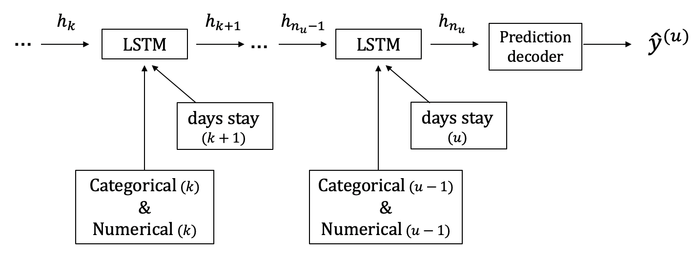

# Booking.com Data Challenge
https://www.bookingchallenge.com/

## BookingNN

```bash
python train_nn.py
```



- LSTM with categorical and numerical features.
- Pretrained weights of `city_id` and `hotel_country` are calculated by Word2Vec.
- Some numerical features are created like `days_stay`, `num_visit_same_city`, and so on.
- `days_stay` at the prediction point can be used and useful in this competition.

```python
from src.datasets import load_train_test, BookingDataset, MyCollator
from src.models import BookingNN
from src.utils import seed_everything
from src.runner import CustomRunner
```
