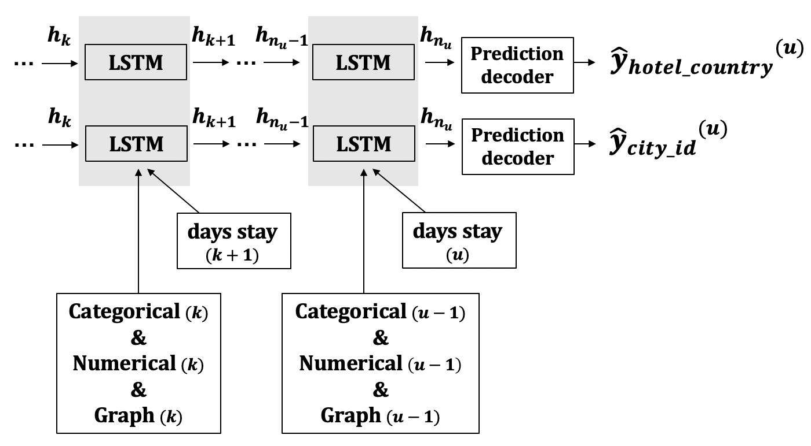

# Booking.com Data Challenge
https://www.bookingchallenge.com/

There are three types of model.

1. BookingNN
1. BookingNN with Multi-task learning
1. BookingNN with Multi-task learning & Data augmentation

| model | fold0 | fold1 | fold2 | fold3 | fold4 | average |
| ---- | ---- | ---- | ---- | ---- | ---- | ---- |
| Baseline | 0.4773 | 0.4388 | 0.4420 | 0.4731 | 0.4837 | 0.4629 |
| BookingNN | 0.5083 | 0.4673 | 0.4728 | 0.4999 | 0.5154 | 0.49274 |
| + Multi-task learning | 0.5086 | 0.4681 | 0.4747 | 0.5012 | 0.5162 | 0.49376 | 
| + Data augmentation | 0.5029 | 0.4575 | 0.4661 | 0.4967 | 0.5082 | 0.48628 |

## BookingNN

```bash
python train_nn.py
```


- LSTM with categorical and numerical features.
- Pretrained weights of `city_id` and `hotel_country` are calculated by Word2Vec.
- Some numerical features are created like `days_stay`, `num_visit_same_city`, and so on.
- `days_stay` at the prediction point can be used and useful in this competition.

```python
from src.datasets import load_train_test, BookingDataset, MyCollator
from src.models import BookingNN
from src.utils import seed_everything
from src.runner import CustomRunner
```

## BookingNNMtl

```bash
python train_nn_mtl.py
```



- Multi-task learning version BookingNN.
- Predict not only `city_id` but also `hotel_country`.

```python
from src.datasets import load_train_test
from src.datasets import BookingDatasetMtl as BookingDataset
from src.datasets import MyCollatorMtl as MyCollator
from src.models import BookingNNMtl as BookingNN
from src.utils import seed_everything
from src.runner import CustomRunnerMtl as CustomRunner
```

## BookingNNAug

Each sequence of trips can be flipped. Be sure to remove `booker_country` in order to keep consistency.

```bash
python train_nn_aug.py
```

```python
from src.datasets import load_train_test
from src.datasets import BookingDatasetAug as BookingDataset
from src.datasets import MyCollatorAug as MyCollator
from src.models import BookingNNAug as BookingNN
from src.utils import seed_everything
from src.runner import CustomRunnerAug as CustomRunner
```

## Graph features

We believe that graph related features are important because it can lead to reconstruct geographical information. Each sequence of trips are just a fragment of it.

The following figure is a scatter plot of `city_id` vectors calculated by Word2Vec. The number of dimension is compressed by umap. Embedding vectors are used as weights in the model.

```bash
python fe_w2v.py
```


## Training tips

- Google Colab with GPU
- Catalyst for PyTorch model training
- Stratified split by the length of each trip
- Use model with best validation score from epoch 11 to 14.
